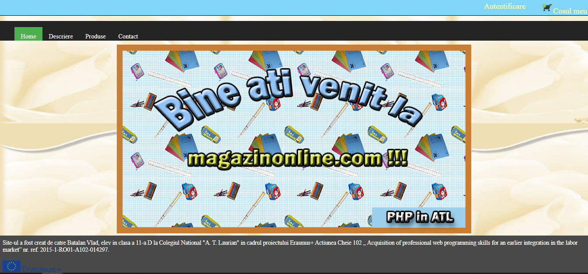

# SchoolShop
Web site made for educational porpouses to teach a group of pupils the basics of PHP programming.

The following link is the presentation of the Php manual in Romanian which includes the context of the project and the use of the website:
https://www.youtube.com/watch?v=XBMfYbNtmGI

